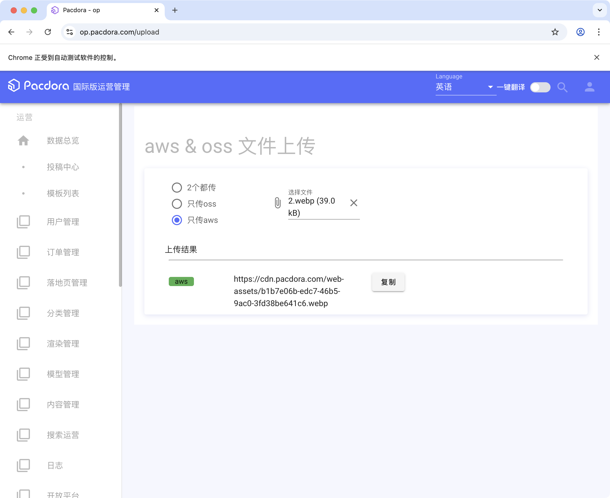

# WSA

> 人中会犯错，特别是在重复性高、容错度低的网页配置环境下，好消息是机器不会。

WSA is a cross-platform desktop application built with PySide6 designed to streamline the process of generating web setup configurations. It automates the extraction of key information from text and facilitates the creation of JSON output for various web page types, helping users efficiently prepare content for web deployment.

## Features

* **Cross-Platform Compatibility:** Built with PySide6 to ensure smooth operation on Windows and macOS.
* **Automated Data Extraction:** Parses copied text from sources like Google Docs to automatically populate fields for URL, Title, Meta Description, Keywords, and more.
* **Intuitive User Interface:** A clear and organized interface with input fields, output display, and action buttons.
* **Folder Management:** Easily browse and open local or network folders for managing associated assets (e.g., images).
* **JSON Generation:** Compiles all collected data into a well-formatted JSON output, ready for use in web setup processes.
* **Clipboard Integration:** Seamlessly copies extracted data and generated JSON to the clipboard for quick pasting.
* **Real-time Feedback:** Provides informative messages and status updates in the output console.

Future todos:
- [ ] complete automation either using MCP or PRA
- [ ] daily report using simpleLLMfunc

## for developers

### set up
first make sure `uv` is installed, if not:

on windows
```bash
powershell -ExecutionPolicy ByPass -c "irm https://astral.sh/uv/0.7.11/install.ps1 | iex"
```

on mac you can use homebrew
```bash
brew install uv
```

clone this repo. then `cd` into it and run in cmd
```bash
uv sync
```

set up your AWS S3 configure by running
```bash
aws configure
```
or you can save your secret information in the `aws_config.json`, which is read by the program if you have not set up the aws configure.

run the app by
```bash
uv run app.py
```

or to your liking, use (adjust to your scenerio if neccessary)
```bash
python app.py
```

Automated packaging and releasing is now made possible by github action. Workflow file is stored at `.github/workflows/build.yaml`.

### notes

- `upload_boto.py` contains a class to upload images and return CDN adress.
  - 或者在本地保存所有key信息，命名为`aws_config.json`
- `upload_selenium_class.py`使用selenium模仿登陆操作，一键自动完成图片的批量上传
  - 使用cookie存储登陆信息
  - 首次需要手动登陆一次，后续可以自动完成

## for users

### 部署

- Now it also supports github action automated release.

    > 但是根据公式的知识产权协定，仅此项目的署名权归我本人，所以此 repository为private，必须dd我进行权限开放。
- 或者使用其他途径得到的压缩包等

### 使用
大幅简化了使用流程，现在你只需要：
1. 进入对应的Google docs文档，简易格式化
2. 对已格式化的文本使用`cmd + A` + `cmd + C`复制全文
3. 进入WSA程序，选择对应的页面类型`Type`
4. 点击`Update`全部自动更新

还可以进行cdn图片一键上传
1. 确保已经连接上NAS云盘
2. 点击upload
3. 如果已经上传过了，所有cdn链接都存放在nas中的`cdn.json`中


follow the instructions given inside the app. or go to this notion page for more details.

**Configuration panel字段面板**
- 选择`Type`
- 调整`Title`，`Meta Description`，`Keywords`等其他配置参数
- 点击`discover and explore`打开一个新面板，编辑更详细的dicover和explore细节
- `More跳转`默认是#mockup-display


**CDN panel图片链接面板**
- 点击browse folder打开文件管理器定位图片（此时文件夹默认定位在NAS网盘pacdora.com文件中），也可以在上方输入框中手动输入

（macos用户也可以直接打开了）
- 点击open folder可以查看已定位的图片文件夹（需要连接到NAS网络）
- 点击upload将文件夹内图片上传，自动获取链接，存储到本地

图片文件夹中图片的命名存在着一定规律：
- cover相关的图片命名为
  - 第一个封面：green lantern mockup 515151
  - 第二个封面：green lantern mockup more 191919
- 设计步骤
  - step1: 1
  - step2: 2
  - step3: 3
- feature图片（或者其他名字，我并不是很清楚
  - feature1: a
  - feature2: b
  - feature3: c
  - feature4: d

存在以下几种方法进行图片上传：

第一种：使用selenium创建一个bot自动上传并获取cdn链接
1. 确保你已经安装了chrome
2. 更新相应链接
3. 使用open folder功能打开文件进行核查（推荐在第一次使用时进行）
4. 在使用activate后，进行登陆
5. 自动开始上传并保存最后的链接

第二种：由于selenium的性能限制和网络问题，不是每次都可以使用自动化工具进行图片上传
使用基于boto3的aws自动上传，需要在文件夹中配置`aws_config.json`。

第三种：
可以手动上传图片，然后保存到nas素材文件夹的`cdn.json`中。
- 这种方法适合二次图片修改
- 可以通过删除该文件，重新上传所有图片（适合全部图片都要修改）

**Program Output结果信息面板**
输出所有程序运行得到的信息，其中信息可以分类为
- info
- success
- warning
- error
- 其他


### Important Notes

- If you are on macOS, ensure you are connected to the NAS server (`/Volumes/shared/pacdora.com/`) every time you reboot your computer for the "Browse Folder" functionality to work as expected.
- If parsing fails or shows warnings, verify that the copied article is correctly formatted and contains the expected keywords.

## Acknowledgement

- Shout out to mirtle@pacdora.com for the prototype.
- contact xolarvill@gmail.com or victorli@pacdora.com