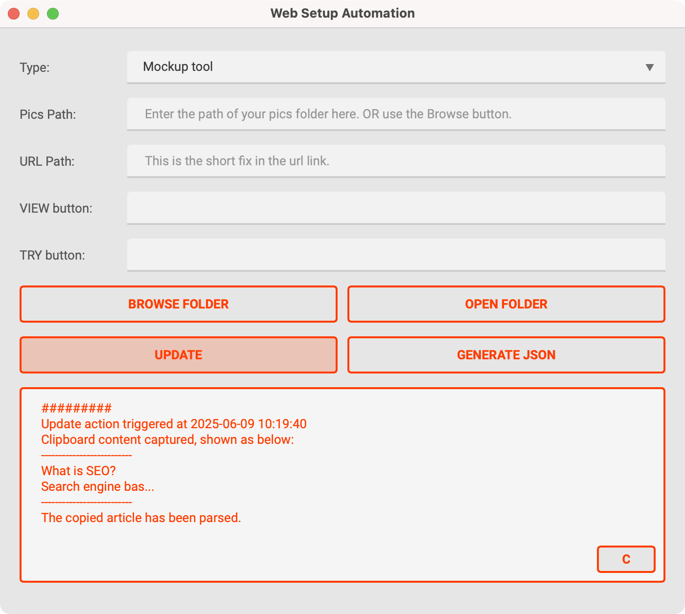

# WSA

this is a project using PySide6 for gui, avoiding cross-platform issues.

## for developers

first make sure `uv` is installed, if not:

on windows
```bash
powershell -ExecutionPolicy ByPass -c "irm https://astral.sh/uv/0.7.11/install.ps1 | iex"
```

on mac you can use homebrew
```bash
brew install uv
```

clone this repo. then `cd` into it and run in cmd
```bash
uv sync
```

run the app by
```bash
uv run app.py
```

or to your liking, use
```bash
python app.py
```

then use `PyInstaller` and MAKEFILE to pack the whole project into a distributable file.
- for windows, it is a `--onefile` exe.
- for macos, it is app.

build for all platforms
```bash
make build-all
```

build for win only
```bash
make build-win
```

build for mac only
```bash
make build-mac
```

## for users


follow the instructions given inside the app. or go to this notion page for more details.

- 点击browse folder打开文件管理器定位图片（此时文件夹默认定位在NAS网盘pacdora.com文件中），也可以在上方输入框中手动输入

（macos用户也可以直接打开了）
- 点击open folder可以查看已定位的图片文件夹
- 点击Parse，自动从剪切板中获取已复制的docs文本进行解析，同时更新至上方输入框

- 点击Generate JSON生成JSON文件，所有信息以文本框展示的为基准

## problem
URL
aluminium-bottle-mockup
Title:
Free Aluminium Bottle Mockup Design
Meta Description
Create stunning aluminium bottle mockups with Pacdora. Choose from 16.6 oz, 33.8 oz or other capacities, customize label, color. Download HD images instantly.
Breadcrumb
Aluminium Bottle Mockup
View all aluminium bottle mockups:/mockups/tumbler-mockup
Make an aluminium bottle mockup:/mockup-detail/steel-bottle-water-bottle-stainless-steel-mockup-510170

## Acknowledgement

- Shout out to mirtle@pacdora.com for the prototype.
- contact xolarvill@gmail.com or victorli@pacdora.com