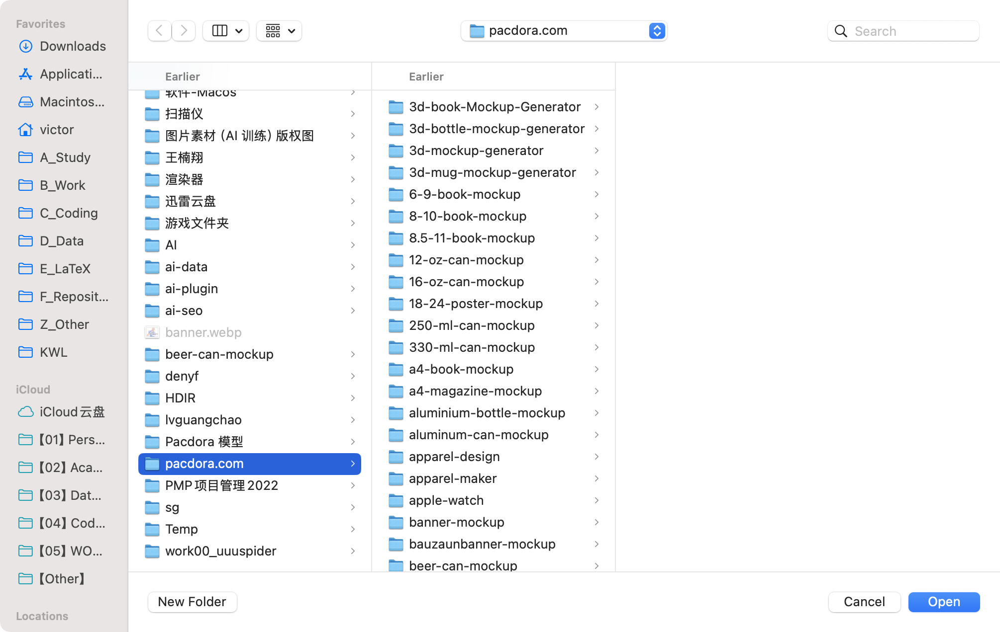

# WSA

this is a project using PySide6 for gui, avoiding cross-platform issues.

## for developers

first make sure `uv` is installed, if not:

on windows
```bash
powershell -ExecutionPolicy ByPass -c "irm https://astral.sh/uv/0.7.11/install.ps1 | iex"
```

on mac you can use homebrew
```bash
brew install uv
```

clone this repo and run in cmd
```bash
uv sync
```

run the app by
```bash
uv run app.py
```

or to your liking, use
```bash
python app.py
```

then use `PyInstaller` and MAKEFILE to pack the whole project into a distributable file.
- for windows, it is a `--onefile` exe.
- for macos, it is app.

build for all platforms
```bash
make build-all
```

build for win only
```bash
make build-win
```

build for mac only
```bash
make build-mac
```

## for users

follow the instructions given inside the app. or go to this notion page for more details.

点击browse folder打开文件管理器定位图片


（macos用户也可以直接打开了）

## update logs

2025.6.5 构建了一个初步可用的框架，基于PySide6构建符合Material Design的网页设置自动化app。在前人基础上进行了逻辑优化和视觉效果优化，添加了新的一键从Google Docs解析所有字段功能（待进一步实现）。同时还设置了makefile助于以后打包发布。

## problem
URL
aluminium-bottle-mockup
Title:
Free Aluminium Bottle Mockup Design
Meta Description
Create stunning aluminium bottle mockups with Pacdora. Choose from 16.6 oz, 33.8 oz or other capacities, customize label, color. Download HD images instantly.
Breadcrumb
Aluminium Bottle Mockup
View all aluminium bottle mockups:/mockups/tumbler-mockup
Make an aluminium bottle mockup:/mockup-detail/steel-bottle-water-bottle-stainless-steel-mockup-510170
#
