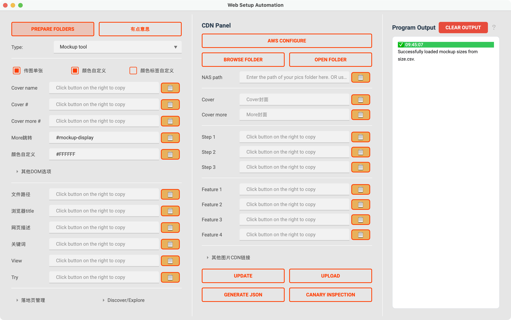

# WSA

WSA is a cross-platform desktop application built with PySide6 designed to streamline the process of generating web setup configurations. It automates the extraction of key information from text and facilitates the creation of JSON output for various web page types, helping users efficiently prepare content for web deployment.

## Features

* **Cross-Platform Compatibility:** Built with PySide6 to ensure smooth operation on Windows and macOS.
* **Automated Data Extraction:** Parses copied text from sources like Google Docs to automatically populate fields for URL, Title, Meta Description, Keywords, and more.
* **Intuitive User Interface:** A clear and organized interface with input fields, output display, and action buttons.
* **Folder Management:** Easily browse and open local or network folders for managing associated assets (e.g., images).
* **JSON Generation:** Compiles all collected data into a well-formatted JSON output, ready for use in web setup processes.
* **Clipboard Integration:** Seamlessly copies extracted data and generated JSON to the clipboard for quick pasting.
* **Real-time Feedback:** Provides informative messages and status updates in the output console.

Future todos:
- [ ] complete automation either using MCP or PRA
- [ ] daily report using simpleLLMfunc

## for developers

first make sure `uv` is installed, if not:

on windows
```bash
powershell -ExecutionPolicy ByPass -c "irm https://astral.sh/uv/0.7.11/install.ps1 | iex"
```

on mac you can use homebrew
```bash
brew install uv
```

clone this repo. then `cd` into it and run in cmd
```bash
uv sync
```

run the app by
```bash
uv run app.py
```

or to your liking, use
```bash
python app.py
```

then use `PyInstaller` and MAKEFILE to pack the whole project into a distributable file.
- for windows, it is a `--onefile` exe.
- for macos, it is app.

build for all platforms
```bash
make build-all
```

build for win only
```bash
make build-win
```

build for mac only
```bash
make build-mac
```

Automated packaging and releasing is now made possible by github action. Workflow file is stored at `.github/workflows/build.yaml`.


## for users

### 部署

- Now it also supports github action automated release.

    > 但是根据公式的知识产权协定，仅此项目的署名权归我本人，所以此 repository为private，必须dd我进行权限开放。
- 或者使用其他途径得到的压缩包等

### 使用
大幅简化了使用流程，现在你只需要：
1. 进入对应的Google docs文档，简易格式化
2. 对已格式化的文本使用`cmd + A` + `cmd + C`复制全文
3. 进入WSA程序，选择对应的页面类型`Type`
4. 点击`Update`全部自动更新


follow the instructions given inside the app. or go to this notion page for more details.

- 点击browse folder打开文件管理器定位图片（此时文件夹默认定位在NAS网盘pacdora.com文件中），也可以在上方输入框中手动输入

（macos用户也可以直接打开了）
- 点击open folder可以查看已定位的图片文件夹
- 点击Parse，自动从剪切板中获取已复制的docs文本进行解析，同时更新至上方输入框
- 点击Generate JSON生成JSON文件，所有信息以文本框展示的为基准

### Important Notes

- If you are on macOS, ensure you are connected to the NAS server (`/Volumes/shared/pacdora.com/`) every time you reboot your computer for the "Browse Folder" functionality to work as expected.
- If parsing fails or shows warnings, verify that the copied article is correctly formatted and contains the expected keywords.

## Acknowledgement

- Shout out to mirtle@pacdora.com for the prototype.
- contact xolarvill@gmail.com or victorli@pacdora.com