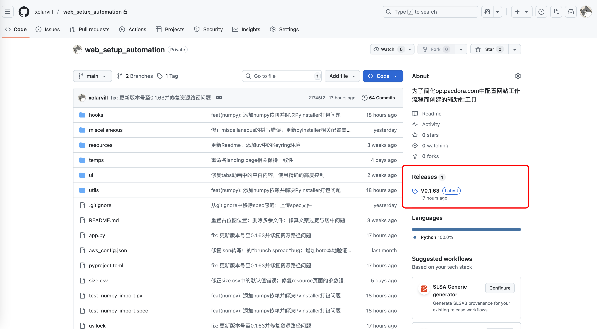
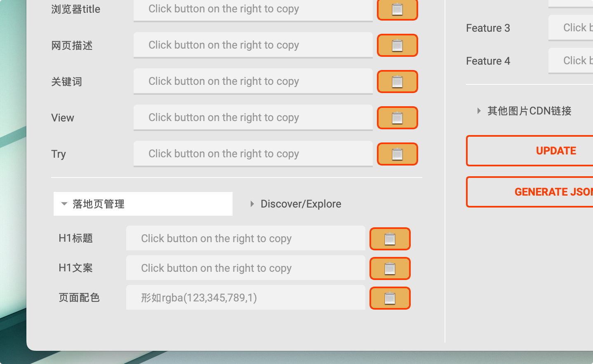

# WSA

> 人中会犯错，特别是在重复性高、容错度低的网页配置环境下，好消息是机器不会。

WSA is a cross-platform desktop application built with PySide6 designed to streamline the process of generating web setup configurations. It automates the extraction of key information from text and facilitates the creation of JSON output for various web page types, helping users efficiently prepare content for web deployment.

## Features

* **Cross-Platform Compatibility:** Built with PySide6 and keyring to ensure smooth operation on Windows and macOS.
* **Automated Data Extraction:** Parses copied text from sources like Google Docs to automatically populate fields for URL, Title, Meta Description, Keywords, and more.
* **Intuitive User Interface:** A clear and organized interface with input fields, output display, and action buttons.
* **Folder Management:** Easily browse and open local or network folders for managing associated assets (e.g., images).
* **JSON Generation:** Compiles all collected data into a well-formatted JSON output, ready for use in web setup processes.
* **Clipboard Integration:** Seamlessly copies extracted data and generated JSON to the clipboard for quick pasting.
* **Real-time Feedback:** Provides informative messages and status updates in the output console.

Todos:
- [x] better ui scaling for much information
- [x] cross-platform AWS secret management
- [ ] support all formats of json file
  - [x] mockup tool
  - [x] landing page
  - [ ] topic
  - [ ] universal topic
  - [ ] tools
- [ ] clean and neat distribution

## for developers

### set up
first make sure `uv` is installed, if not:

on windows
```bash
powershell -ExecutionPolicy ByPass -c "irm https://astral.sh/uv/0.7.11/install.ps1 | iex"
```

on mac you can use homebrew
```bash
brew install uv
```

clone this repo. then `cd` into it and run in cmd
```bash
uv sync
```

set up your AWS S3 configure by running
```bash
aws configure
```
or you can save your secret information in the `aws_config.json`, which is read by the program if you have not set up the aws configure.

run the app by
```bash
uv run app.py
```

Automated packaging and releasing is now made possible by github action. Workflow file is stored at `.github/workflows/build.yaml`.

### Notes for Developers

#### Credentials Management

The application uses a hierarchical approach to manage AWS credentials, ensuring both security and flexibility. The order of precedence is as follows:

1.  **Keyring (Recommended):** The primary and most secure method. Credentials are saved via the in-app "AWS Configure" UI and stored in the operating system's native credential manager (e.g., macOS Keychain, Windows Credential Manager) using the `keyring` library. This avoids storing sensitive information in plaintext files.
2.  **AWS CLI (`~/.aws/credentials`):** If no credentials are found in Keyring, the application's underlying libraries (like `boto3`) will automatically look for credentials configured via the standard `aws configure` command. This is a good fallback for developers who already use the AWS CLI.
3.  **`aws_config.json` (Legacy Fallback):** As a final resort, the application will check for a local `aws_config.json` file in the root directory. This method is considered legacy and is less secure. It should only be used if the above methods are not feasible.

#### UI widgets

The `CollapsibleBox` is a reusable widget that can be used to create collapsible sections in the UI.

```python
# Create a collapsible box with a title
collapsible_box = CollapsibleBox("My Collapsible Box")

# Create a layout for the content of the box
content_layout = QVBoxLayout()
content_layout.addWidget(QLabel("This is the content of the box."))
content_layout.addWidget(QPushButton("A button"))

# Set the content layout for the box
collapsible_box.setContentLayout(content_layout)

# Add the collapsible box to your main layout
main_layout.addWidget(collapsible_box)
```

The `HorizontalCollapsibleTab` is a horizontal foldable panel switch base on the design of `CollapsibleBox`.

```python
# ... (in your main window setup)
tabs = HorizontalCollapsibleTabs()

# Tab 1
content1 = QWidget()
layout1 = QVBoxLayout(content1)
layout1.addWidget(QLabel("This is the content for Tab 1"))
tabs.add_tab("Tab 1", content1)

# Tab 2
content2 = QWidget()
layout2 = QVBoxLayout(content2)
layout2.addWidget(QLabel("This is the content for Tab 2"))
tabs.add_tab("Tab 2", content2)

# Add the tabs widget to your main layout
main_layout.addWidget(tabs)
```
### Other Notes

- `upload_boto.py` contains a class to upload images and return CDN adress.
- `upload_selenium_class.py` uses Selenium to automate login and bulk image uploads. It stores login information using cookies, requiring a manual login only on the first use.


## for users

### 部署

- Now it also supports github action automated release.

    > 但是根据公式的知识产权协定，仅此项目的署名权归我本人，所以此 repository为private，必须dd我进行权限开放。
- 或者使用其他途径得到的压缩包等

### 使用


大幅简化了使用流程，现在你只需要：
1. 进入对应的Google docs文档，简易格式化
   - 大段内容用#分割
   - FAQ中每个问题用空行分割 
2. 对已格式化的文本使用`cmd + A` + `cmd + C`复制全文
3. 进入WSA程序，选择对应的页面类型`Type`
4. 点击`Update`全部自动更新
5. 补充填写一些必要的内容
6. 点击`Upload`上传图片获取cdn链接（*如果没有则跳过*）
7. 点击`Generate JSON`生成JSON文件自动复制到剪切板
8. 在op后台编辑器中填写相关字段并保存
9. 返回app点击`Canaray Inspection`自动跳转到相关灰度测试页面以便于二次核查

还可以进行cdn图片一键上传
1. **配置AWS凭证 (首次使用)**：
   - 在 "CDN Panel" 中，点击 `AWS Configure` 按钮。
   - 在弹出的窗口中，输入您的 `Access Key ID`, `Secret Access Key`, 和默认 `Region`。
   - 点击 `Save`。您的凭证将被安全地存储在您操作系统的钥匙串中，无需在本地保存任何敏感文件。
2. **选择图片文件夹**：确保已经连接上NAS云盘，然后点击 `Browse Folder` 选择包含图片的文件夹。
3. **上传图片**：点击 `Upload` 按钮。程序会自动上传文件夹中尚未记录在`cdn.json`里的新图片。
4. **自动填充**：上传成功后，所有CDN链接会自动填充到对应的字段中，并保存在图片文件夹内的`cdn.json`文件中，方便下次直接使用。

**Configuration panel字段面板**
- 选择`Type`
- 调整`Title`，`Meta Description`，`Keywords`等其他配置参数
- 点击啊`其他DOM选项`可以打开一些使用频率较低的DOM配置选项

- 点击`落地页管理`可以获取与Landing page相关的字段


**CDN panel图片链接面板**

- 使用`AWS configure`配置aws secret
- 点击`browse folder`打开文件管理器定位图片（此时文件夹默认定位在NAS网盘pacdora.com文件中），也可以在上方输入框中手动输入

（macos用户也可以直接打开了）
- 点击`open folder`可以查看已定位的图片文件夹（需要连接到NAS网络）
- 点击`upload`将文件夹内图片上传，自动获取链接，存储到本地
  - 如果`upload`中存在空字段（以及来了两张图片，但不够，后面又来了其他图片），系统会自动识别并继续上传
  - 上传图片获取的cdn链接自动存储在对应文件夹中的`cdn.json`

存在以下几种方法进行图片上传：

第一种：使用selenium创建一个bot自动上传并获取cdn链接（legacy）
1. 确保你已经安装了chrome
2. 更新相应链接
3. 使用open folder功能打开文件进行核查（推荐在第一次使用时进行）
4. 在使用activate后，进行登陆
5. 自动开始上传并保存最后的链接

第二种：由于selenium的性能限制和网络问题，不是每次都可以使用自动化工具进行图片上传
使用基于boto3的aws自动上传，需要先配置AWS Secret。
- 在项目文件夹打开终端，配置awscli
- 使用aws configuration panel配置信息，其信息自动保存至系统级密码储存位置。
- 如果以上方法都失效，需要在文件夹中配置`aws_config.json`（存在较大安全隐患，非常不推荐）。

第三种：
可以手动上传图片，然后保存到nas素材文件夹的`cdn.json`中。
- 这种方法适合二次图片修改
- 可以通过删除该文件，重新上传所有图片（适合全部图片都要修改）

**-> 推荐使用第二种方法，第一次使用时在面板中配置aws信息。**


同时，图片文件夹中图片的命名存在着一定规律：

- cover相关的图片命名为（这会影响cover字段的识别）
  - 第一个封面：green lantern mockup 515151
  - 第二个封面：green lantern mockup more 191919
- 设计步骤
  - step1: 1
  - step2: 2
  - step3: 3
- feature图片（或者其他名字，我并不是很清楚
  - feature1: a
  - feature2: b
  - feature3: c
  - feature4: d
- banner需要命名为banner
- 其他名称的图片会自动记录并保存到`cdn.json`中，但不会出现在程序面板中


**Program Output结果信息面板**


输出所有程序运行得到的信息，其中信息可以分类为
- info
- success
- warning
- error
- 其他

其中：
- 点击问号按钮，自动跳转到github的readme界面
- 点击`Clear output`清楚面板中所有信息，同时将所有组件的内容重置到初始状态

### OP后台相关事项
- `has-size`的选择直接影响了DOM右侧的界面会出现什么选项，例如Box会出现尺寸的选择，否则即使

### Important Notes

- If you are on macOS, ensure you are connected to the NAS server (`/Volumes/shared/pacdora.com/`) every time you reboot your computer for the "Browse Folder" functionality to work as expected.
- If parsing fails or shows warnings, verify that the copied article is correctly formatted and contains the expected keywords.

## Acknowledgement

- Shout out to mirtle@pacdora.com for the original idea and snippets.
- For support, contact me at xolarvill@gmail.com or bayuejiake@163.com.